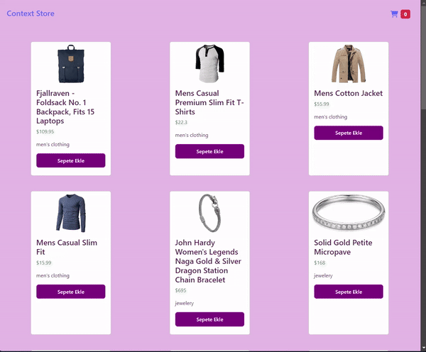

<h1> API Context Proje </h1>

Bu proje, React Context API kullanarak bir alışveriş sepetini yönetmeyi amaçlamaktadır.

<h2>Context API</h2>

<ul>

<li>React Context API React uygulamalarında verileri iletmek ve paylaşmak için kullanılan bir özelliktir. Bu API bileşenler arasında veri iletişimini kolaylaştırarak "prop drilling" sorununu çözmeye yardımcı olur. Prop drilling bir bileşenin diğer alt bileşenlere veri aktarabilmek için bir dizi prop (özellik) kullanması durumudur.</li>
<li>React Context API, bir veri deposu (store) oluşturmanıza ve bu depoyu uygulama genelinde paylaşmanıza olanak tanır. Böylece herhangi bir bileşen bu depoya erişim sağlayabilir ve depodaki verilere ihtiyaç duyduğunda kullanabilir. Bu özellik özellikle büyük ve karmaşık uygulamalarda veri yönetimini kolaylaştırır. </li>
<li>Context API, özellikle global durum yönetimi, kullanıcı oturumu gibi uygulama genelinde paylaşılması gereken verilerin yönetimi için kullanılır. Bu sayede, verileri props zinciri boyunca iletmek yerine, ihtiyaç duyulan herhangi bir bileşen doğrudan ilgili context'ten veri alabilir.</li>

</ul>

<h2> Özellikler </h2>

<ul>

<li> AnaSayfa (MainPage):
<ul>
<li>FakeStoreAPI üzerinden ürün verilerini Axios kullanarak çeker.</li>
<li>Ana sayfada ürün kartlarını gösterir.</li>
<li>Kullanıcılara ürünleri sepete eklemeleri için olanak tanır.</li>
</ul>
</li>
</ul>

<ul>
<li> Sepet Sayfası (Checkout):
<ul>
<li>Kullanıcının sepetindeki ürünleri listeler.</li>
<li>Toplam tutarı hesaplar ve gösterir.</li>
<li>Her bir ürünü artırmak veya azaltmak için ok simgeleri ile etkileşim sağlar.</li>
<li>Sepette hiç ürün yoksa, kullanıcıyı ürün eklemeye davet eder.</li>
</ul>
</li>
</ul>

<ul>
<li> BasketContext ve BasketProvider:
<ul>
<li>BasketContext, alışveriş sepeti durumu ve ilgili fonksiyonlar için bir bağlam sağlar.</li>
<li>BasketProvider bileşeni, alışveriş sepeti durumunu yönetmek için useState kullanır ve ürün eklemek veya çıkarmak için fonksiyonlar içerir.</li>
</ul>
</li>
</ul>

<ul>
<li> Loading Component:
<ul>
<li>Veriler yüklenirken kullanıcıya bir yükleniyor mesajı gösterir.</li>
</ul>
</li>
</ul>

<ul>
<li> Header Component:
<ul>
<li>Sayfanın üst kısmında bulunan navigasyon başlığını oluşturur.</li>
<li>Ana sayfa ve sepete yönlendiren linkler içerir.</li>
<li>Sepetteki toplam ürün sayısını gösteren bir badge bulunur.</li>
</ul>
</li>

</ul>

<h2> Kullanilan Teknolojiler </h2>
<ul>
<li>React</li>
<li>React Router DOM</li>
<li>Axios</li>
<li>Bootstrap</li>
<li>React Icons</li>

</ul>

<h2>Ekran Görüntüsü</h2>

